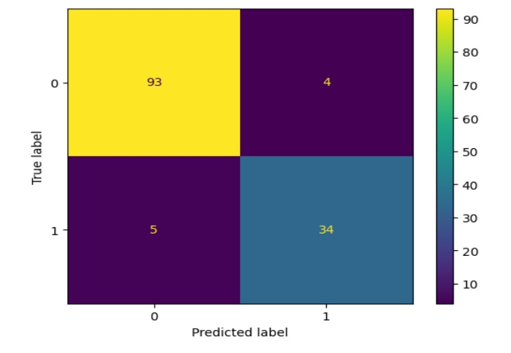
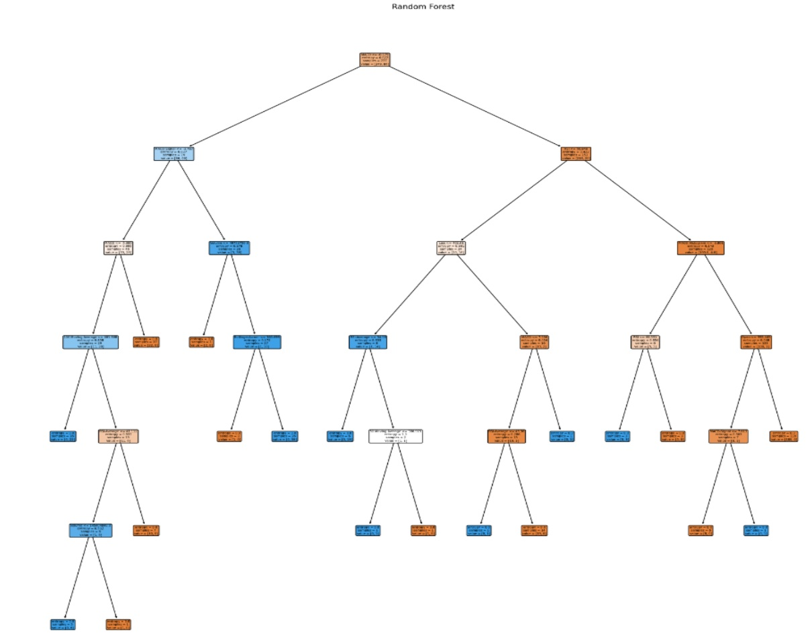

# ML_AI_Project
# Stock Market Prediction on a strategy

## NON-TECHNICAL EXPLANATION
The project is to determine when to enter/exit a trade based on a trailing stop strategy
A trailing stop is defined by gradually moving a stop-loss up to protect gained profits. [https://www.investopedia.com/articles/trading/08/trailing-stop-loss.asp]

The idea is that you cannot exactly state when you will reach a market top. Nor can you exactly state when the market has hit a bottom. 
A better approach is to wait for indications of a market recovering before entering a trade. Otherwise you are guessing while price is falling where to buy.

A good definition of a bull / bear market and what it means is [https://www.investopedia.com/ask/answers/bull-bear-market-names/#toc-examples-of-bull-and-bear-markets]

A bull market typically lasts longer than a bear market. The latter tends to be short, sharp and violent. Which is why these events have been removed from the training data.

Predicting price movement is very common activity [https://www.kaggle.com/code/faressayah/stock-market-analysis-prediction-using-lstm]
Using yahoo data is a common data source but few model using technical analysis. A step on from this is to determine how a strategy would perform. Which is the basis for the project.

## DATA
A summary of the data you’re using, remembering to include where you got it and any relevant citations. 

The dataset is from Barchart and contains no personally identifiable data. All data is from publicly available sources of the stock market for the main information. The detailed stock information is downloaded from Barchart.
A datasheet for the project is in the folder. This includes steps to obtain your own data

It seems from this source that a time without significant movement is:-
1 March 2022 – 1 July 2024
[https://en.wikipedia.org/wiki/List_of_stock_market_crashes_and_bear_markets]

This is a period that did not have any major shocks for the US market. Major shocks would skew results and would mean that really you would need to include market sentiment to understand the move. This adds another layer of complexity and is out of scope for this project.

# Biases

The dataset dates used within the modelling are when there are not periods of market corrections. This period is also when AI was launched mainstream. This resulted in a positive market (bullish) which may hinder performance in a neutral or down trending (bearish) market. Hence it is naturally geared towards an uptend.

## MODEL 
A summary of the model you’re using and why you chose it. 

The chosen model type is a random forest since this is a classification problem. Given there are different types of indicators, it is best to split these out and get an aggregate view. The model is interpretable which is key for working out methodology and progress to more advanced models with more time.

## HYPERPARAMETER OPTIMSATION
Description of which hyperparameters you have and how you chose to optimise them. 
Within a random forest there are the following hyper parameters

{'bootstrap',
 'ccp_alpha',
 'class_weight',
 'criterion',
 'max_depth',
 'max_features',
 'max_leaf_nodes',
 'max_samples',
 'min_impurity_decrease',
 'min_impurity_split',
 'min_samples_leaf',
 'min_samples_split',
 'min_weight_fraction_leaf',
 'n_estimators',
 'n_jobs',
 'oob_score',
 'random_state',
 'verbose',
 'warm_start'}
 
I will be optimising the following since they have significant impact
criterion
max_samples
max_depth
max_features
n_estimators

See model notebook for the implementation. Criterion is categorical which requires special attention.

## RESULTS

The biggest difference was how much difference Bayesian Optimisation on the hyperparameters made to the complexity of the tree. Through my own devised way of mixing categorical hyperparameters the resulting tree is much simpler. A max depth of 5 vs default values of 7 across multiple trees. The final tree is below, the details are in the 'random forest' notebook.

The classification report is here- 

The confusion matrix is here-

The resulting tree is here-

This is showing a tree that is broader and less fit to the training data. Given more time I would investigate the optimisation further and look to retry with say hourly data.

## FURTHER TIME
Given more time on the project I would do next:-
- Explore the hybrid approach to BO and see how this could be applied to more models. Also improve the underlying code to be more efficient and see if Optuna / Turbo methodologies can be incorporated.
- Investigate performance on a larger dataset. For instance hourly data.
- Expand the trading model to have variable margin for the BUY/SELL decisions
- Determine if Elliot Wave Theory can be incorporated [https://www.investopedia.com/articles/active-trading/010715/how-trade-breakouts-using-elliott-wave-theory.asp]
- Expand the source data to individual stocks rather than just SPY
- Review other Model types and see if we can expand into deep learning and maybe unsupervised learning when the dataset is large
